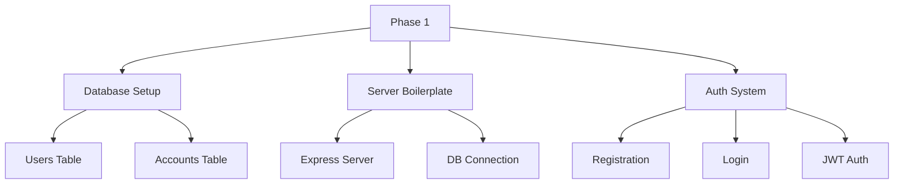
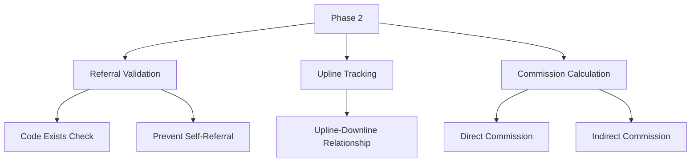
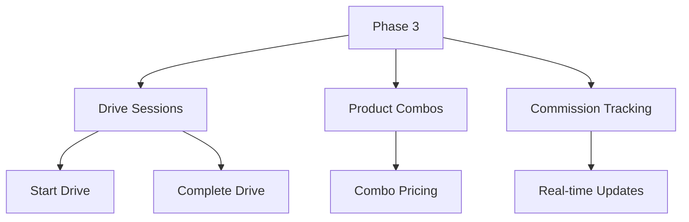
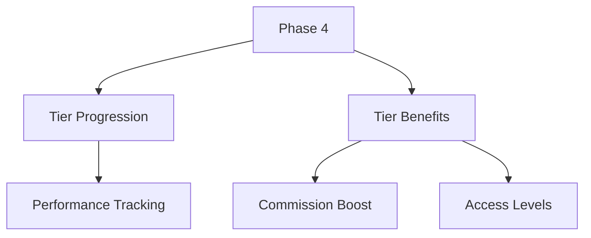
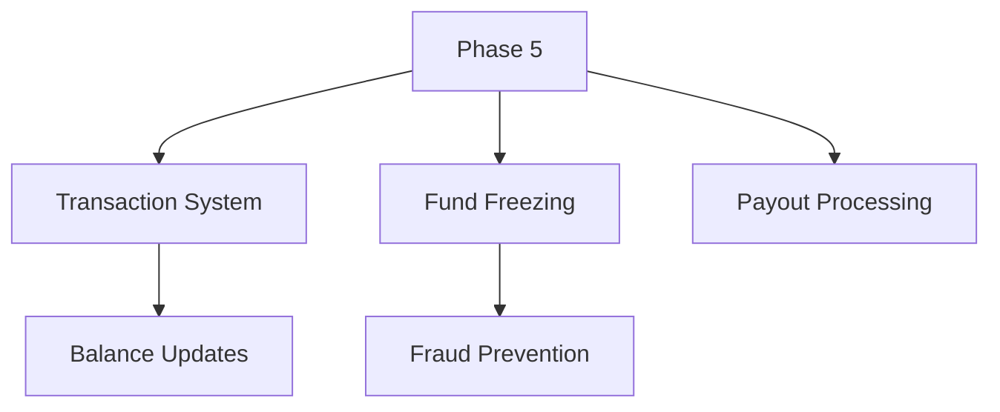
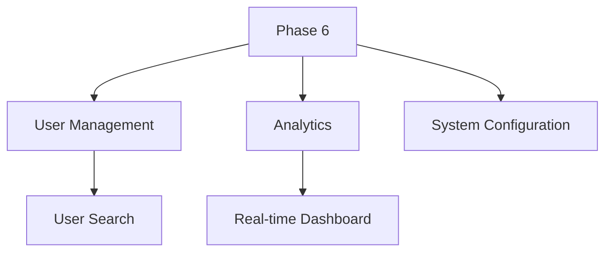

# Backend Implementation Plan

## 1. Phase 1 - Foundation Setup & Authentication

### Implementation Steps:
1. **Database Initialization**
   - Create PostgreSQL database `affiliate_db`
   - Run schema setup from `sql/init.sql`
   - *Verification*: `SELECT * FROM pg_tables WHERE schemaname='public'`

2. **Server Boilerplate**
   - Create `server/` directory with Express setup
   - Configure environment variables (.env)
   - *Verification*: Server responds to GET /api/status

3. **Registration System**
   - POST /api/auth/register endpoint
   - Referral code validation logic
   - *Verification*: New user appears in DB with encrypted password

4. **Login & JWT**
   - POST /api/auth/login endpoint
   - JWT token generation
   - Auth middleware for protected routes
   - *Verification*: Successful login returns valid JWT

---

## 2. Phase 2 - Affiliate System Core

### Implementation Steps:
1. **Referral Code Handling**
   - Add referral code generation on registration
   - *Verification*: New users get unique 8-character codes

2. **Upline Tracking**
   - Store upline_id in users table
   - *Verification*: Downline users appear in upline's record

3. **Commission Calculation**
   - Implement multi-level commission (5-3-1%)
   - *Verification*: Test with 3-level referral chain

---

## 3. Phase 3 - Data Drive System

### Implementation Steps:
1. **Drive Session Management**
   - POST /api/drive/start
   - *Verification*: Drive session appears in database

2. **Product Combo System**
   - Predefined product combinations
   - *Verification*: Combos return correct pricing

---

## 4. Phase 4 - Tier System

### Implementation Steps:
1. **Tier Upgrade Logic**
   - Daily check for tier qualifications
   - *Verification*: Test user upgrades after meeting criteria

---

## 5. Phase 5 - Balance Management

### Implementation Steps:
1. **Balance Operations**
   - Atomic balance updates
   - *Verification*: Test concurrent transactions

---

## 6. Phase 6 - Admin System

---

## Testing Strategy
1. **Unit Tests** - Jest (API endpoints)
2. **Integration Tests** - Database operations
3. **E2E Tests** - Cypress (User flows)

## Documentation
1. API Reference (Swagger)
2. Database Schema Docs
3. Deployment Guide
